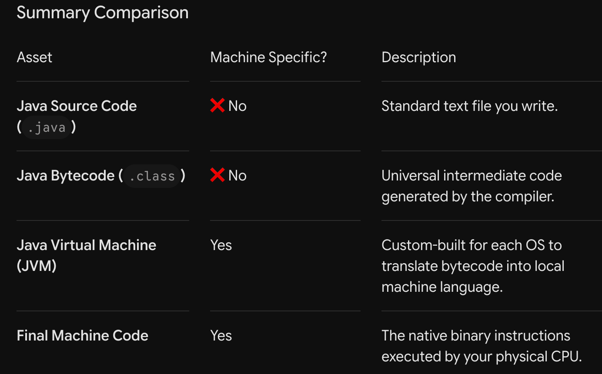

What did we do?

We used only plain java no any other frameworks making it easier.
    Wrote Your Java Console Application
    Ran it in bash 
    Compiled the program using javac HelloWorld.java 
    This generates HelloWorld.class – the bytecode file.
    Ran the application using java HelloWorld 

[ Your Java Code (.java) ]
           │
           ▼  (Compiled by 'javac')
[ Java Bytecode (.class) ]  <-- THIS IS INDEPENDENT of your OS/CPU.Platform Independent
           │
           ▼  (Interpreted/Compiled by JVM)
[ Machine Code (0s and 1s) ] <-- THIS IS SPECIFIC to Windows, Mac, Linux, etc.

